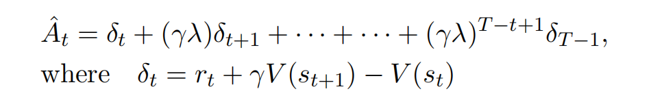

# instruct-gpt结合deepspeed 代码解读

## 第一步 SFT: supervised finetune
1. 训练数据集：与基座模型在大量数据集上训练不一样。这里使用的是人工标注的数据(即挑选出部分prompt，然后人工编写answer的部分)进行finetune的，依旧是进行next token prediciton任务。有监督体现在，这里的answer是人工给出来的正确答案，可以做为label；而不是在网络数据上学习的数据分布。
2. 训练方式LORA：deepspeed中提供了使用LORA进行训练的选项，可以选择对基座模型中的linear层使用LORA训练。对$y = W*X+b$,其中W dim[row,columns]，生成leftW dim [row,lora_dim],rightW [columns,lora_dim]，y = (W*x+b)+$\alpha$*leftW*rightW*x. $\alpha$系数用于控制LORA的影响，训练时对所有其他的参数全部冻结，只训练LORA的参数leftW,rightW.
3. 注意：instructGPT中提到，SFT训练了16个epoch，使用的是reward模型计算的reward score做为评价指标挑选模型的。SFT训练一个epoch后就过拟合了，验证集上的损失上升，但是reward值依然有提升，使用reward值作为挑选指标，能更好地生成更符合人类偏好的回答。

## 第二步 RM: reward model.
1. 使用facebook/opt-350m 模型进行初始化的；log表明是所有参数一起训练的(也可以只微调LORA)。
2. reward model结构，opt-350m接上一个linear(1),映射到1维；因此输入为seq dims[bs,seq_len],由 __prompt+answer+padings__ 组成。输出reward也是[bs,seq_len].
3. batch的数据：一个batch数据中，前一半全部是chosen的句子，后一半全部是rejected的句子；而且i条和i+bs/2条的prompt是一样的，answer正好是一正一负，对应的两条数据组成一对计算pairwise损失。
4. 损失计算：一对数据(chosen_seq,rejected_seq)计算一次损失，chosen_seq的answer对应的reward - rejected_seq的answer对应的reward,取平均值，使用logsigmoid转换成损失。
5. 注意：这里实现和instruct-gpt上说的同一个prompt的K个answer，任意两个组成一个样本计算损失不一样（这样就有了 $C_k^{2}$个样本）。为了解决论文中提到的，一个seq和多个对应seq组合而被训练多次导致过拟合的问题，猜测这里的一个batch里面都是相同的prompt组成的，这样的梯度对一条数据只更新了一次。

## 第三步RLHF reinforce learning from human feedback. 
### 一、 训练结构
这里有两层循环:
1. 外循环:每次产生一个batch的prompt，然后使用actor_model对prompt计算answer，拼接生成seq。并使用actor_model/ref_model, reward/critical对seq计算log_proba,ref_log_proba,reward,values.这些值计算出来后在第二层循环中就不再更新，因此在第二层循环中，这些值可以看成老的分布生成的概率；
2. 内循环:对该batch的seq训练ppo_epochs次(每次训练后shuffle打乱)，每次迭代计算advantage值使用PPO算法对参数进行更新。

### 二、 第一部分训练的数据来源：
可以看出输入是一个batch的prompts（[bs,max_prompt_len]），使用_generate_sequence得到了answer，并将answer和prompt拼接在一起，补充padding，使得每个sequence长度一致。深入来看，生成answer的过程和计算value和reward的过程：

1. 生成answer：使用 __actor_model__ 对prompts 生成answer，并不计入梯度计算和更新，这里使用的actor_model是huggingface上的facebook/opt-1.3b模型，然后经过第一阶段的SFT微调。opt-1.3b的结构和GPT3一样，都是Transformer decoder结构. (根据代码推测一个batch中的prompt的长度应该是完全相同的，所以prompt应该是做了一些padding的。) 然后生成的answer添加到prompt后面拼接成seq。

2. 生成logprobs,ref_logprobs,values和reward： 
    - logprobs和ref_logprobs：actor_model和ref_model对seq计算logit[bs,seq_len]，即每个时间步上对应目标token的probas
    - reward：reward_model 对seq计算的输出序列的最后一个timestamp的值。这是一个标量[bs]. 同时reward_model结构也是opt-1.3b，去掉最后的输出层，并连接linear(1)经过第二步训练得到的。
    - values : critic_model输入seq前推得到[bs,seq_len].
    - 注意这一步所有计算的变量都被detach了，不计算梯度。
    - actor_model和ref_model都是SFT后的模型初始化得到；critical和reward都是由第二步reward训练后的模型初始化。
     

### 三、PPO更新
prompt的长度作为answer计算的起点(只有一个长度),mask后移一位匹配输出。critical_model计算的值作为old_values [bs,seq_len] (不计入梯度),向量reward代表actor_model/ref_model计算的分布KL散度。
1. reward向量计算：
    reward向量等于log_proba和ref_log_proba的KL散度值，在最后一个时刻加上reward_score.

2. advantage value的计算： 
 - 根据这个公式，对照代码不难看出
    - $ V(s_t)$代表value[:,t],
    - $r_t$代表rewards[:,t],
    - for循环中的delta代表第二个公式中的$\delta_t$
    - for循环lastgaelam计算代表：$\hat{A_t} = \delta_t+\gamma \lambda*\hat{A}_{t-1}$，依次迭代得到的结果和第一个公式等价。
    - 由于定义中advantage值是return值减去 value值，所以return由advantage + value获得(不懂). 对应最后一步计算returns.
    - advantage dims:[bs,seq_len],values:[bs,seq_len]

3. 得到advantages和returns后，计算PPO的objective function.
    - actor_model重新计算的序列概率actor_log_prob([bs,seq_len]带梯度)，和log_probas计算loss，log_probas是actor_model在外层循环计算的序列概率，并没有随着模型参数在内层循环更新而更新，因此作为旧分布计算出来的概率值.
    - actor_log_prob(带梯度的)代表$\pi_{\theta}(\alpha_t|s_t)$新分布的概率值, log_probas代表$\pi_{\theta_{old}}(\alpha_t|s_t)$旧分布的概率值.
    - ratio代表$r_{t}(\theta)$,
    - cliprange代表$\epsilon$
    - actor_loss_fn正是第二个公式PPO objective的实现。
    
    

### 4 critic_loss计算
使用values来逼近return,同样使用old_values(critic_model在外层循环提前生成的向量)对values进行clip，防止差异过大。loss等于clip_value-return的差的平方和损失。对应公式中的第二项，为了避免reward模型的过度优化。

### 5 unsupervised training
为了解决模型在公共数据集上的表现倒退的问题，加入了在pretrain数据集(GPT3预训练的数据集而不是SFT数据集)计算的损失值。

